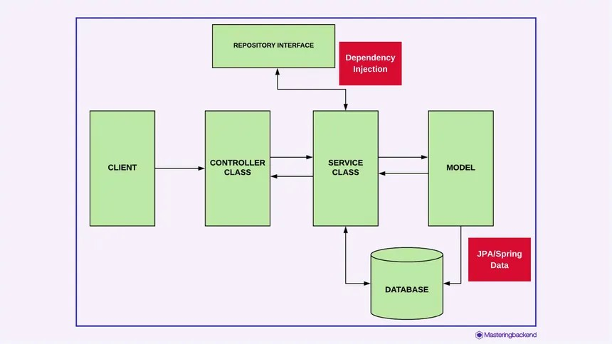

# SIH25093 — University Platform

This repository contains three main components:

- Frontend: React + Vite application (student/faculty/admin UI)
- Backend: Java Spring Boot application (University)
- ML Service: FastAPI microservice for AI resume generation and scoring

Full documentation with a detailed table of contents and per-file descriptions is available in `Project_Documentation.md` and `Project_Documentation.doc`.

Quick Links
- Documentation (Markdown): [Project_Documentation.md](Project_Documentation.md)
- Documentation (RTF): [Project_Documentation.doc](Project_Documentation.doc)

Prerequisites
- Node.js (16+ recommended) and npm/Yarn for frontend
- Python 3.11+ and pip for `ml-service`
- JDK 17 and Maven for the Spring Boot backend

Tech Stack Summary
- Frontend: React 19, Vite, Axios
- ML Service: FastAPI, Uvicorn, scikit-learn, sentence-transformers, Groq / Google Generative AI integrations
- Backend: Spring Boot (Java 17), Spring Data JPA, Spring Security, MySQL, JWT

Installation & Run (local development)

1) Frontend
```bash
cd frontend
npm install
npm run dev
```
By default Vite serves on port 5173; edit `src/services/api.js` to point `baseURL` to your backend if needed.

2) ML Service
```bash
cd ml-service
python -m venv .venv
source .venv/Scripts/activate   # Windows: .venv\Scripts\activate
pip install -r requirements.txt
# create .env with LLM keys and optional overrides
python main.py
# or
uvicorn main:app --host 0.0.0.0 --port 8000 --reload
```
Environment variables (example `.env`):
```
GROQ_API_KEY=your_groq_key_here
GROQ_MODEL=llama-3.1-70b-versatile
GEMINI_API_KEY=your_gemini_key_here
GEMINI_MODEL=gemini-1.5-flash
ML_HOST=0.0.0.0
ML_PORT=8000
SKILLS_MODEL_PATH=models/skills_classifier.pkl
SKILLS_VECTORIZER_PATH=models/skills_vectorizer.pkl
```

3) Backend (University)
```bash
cd University
# configure src/main/resources/application.properties with DB credentials
mvn spring-boot:run
```
Backend Architecture


Repository layout (short)
- `frontend/` — React UI: `src/` contains components, layouts, pages, services
- `ml-service/` — FastAPI microservice: `main.py`, `services/`, `templates/`, `models/`, `requirements.txt`
- `University/` — Spring Boot app: `pom.xml`, Java sources under `src/main/java/com/vvit/University`

How components talk
- Frontend calls the Spring Boot backend (API server) via `src/services/api.js`.
- The backend calls the `ml-service` `/generate-resume` endpoint to create AI-enhanced resumes.

Contributing / Development notes
- Use the `ml-service/training` scripts to (re)train skill-classifier models if needed.
- ML model artifacts should be placed in `ml-service/models/` or paths set via `.env`.
- Frontend authentication uses JWT stored in `localStorage` and `api.js` attaches the token.

Support
- For issues, open a GitHub issue in the repository.

